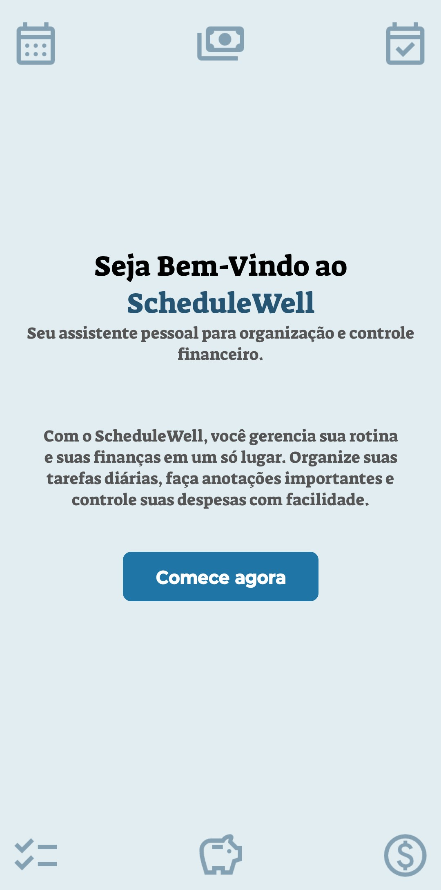
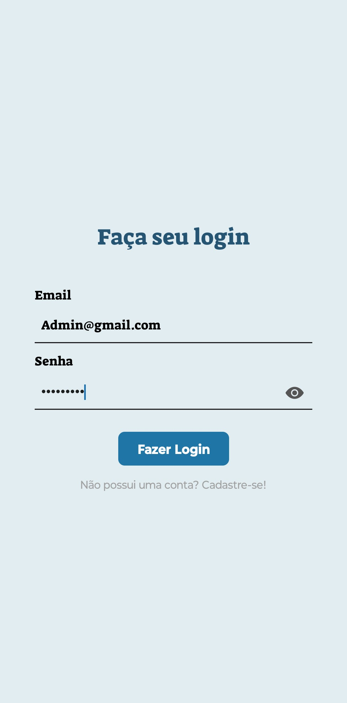
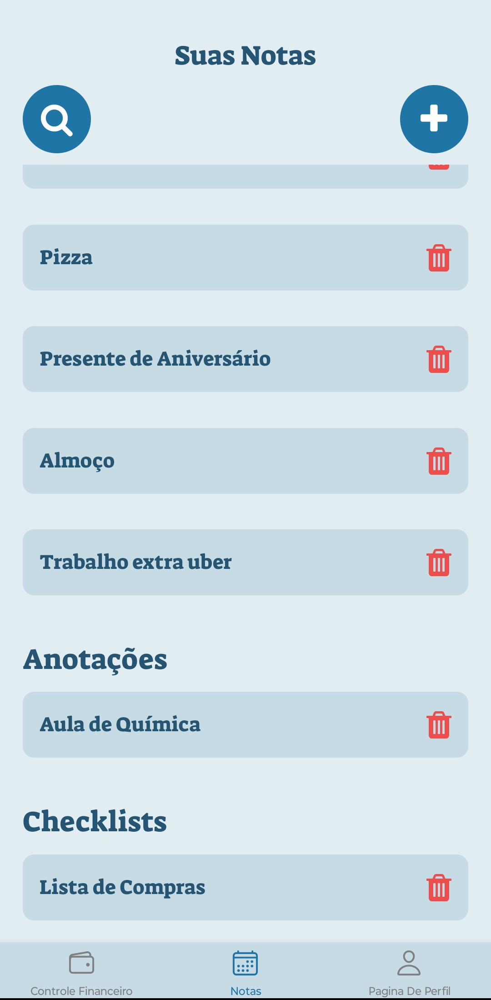
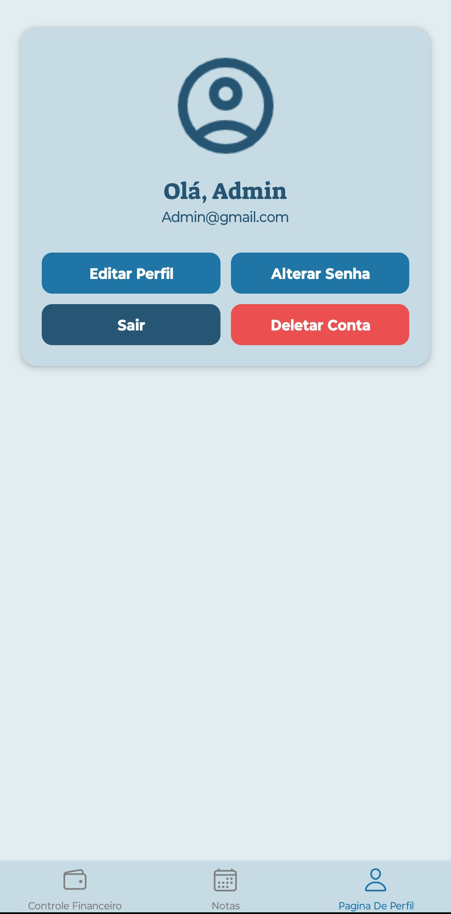
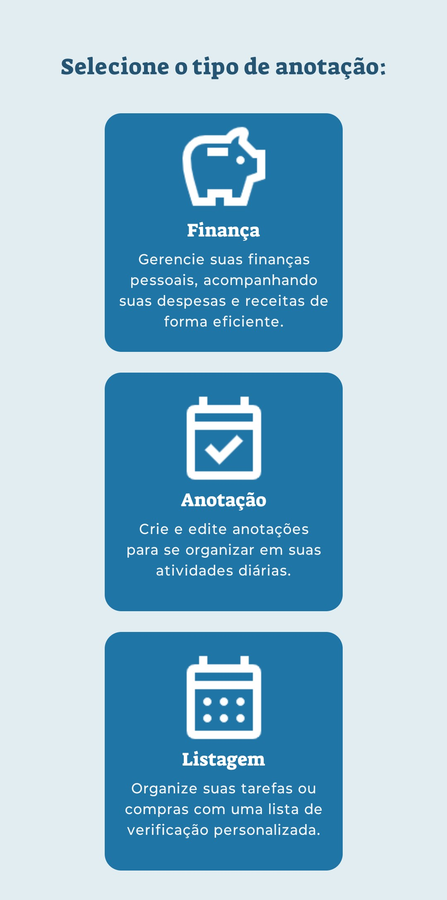
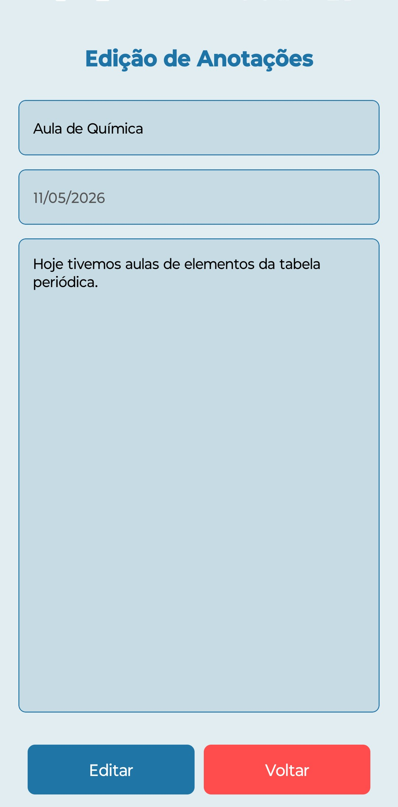
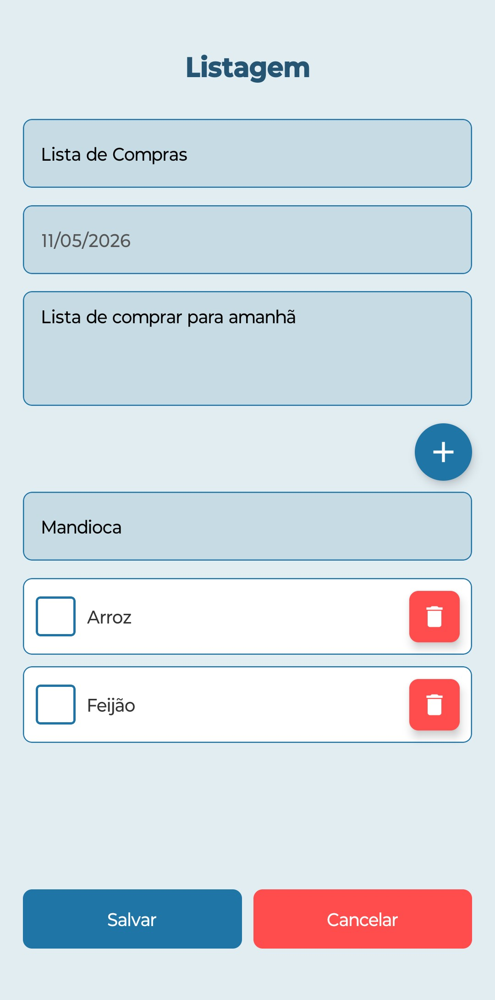
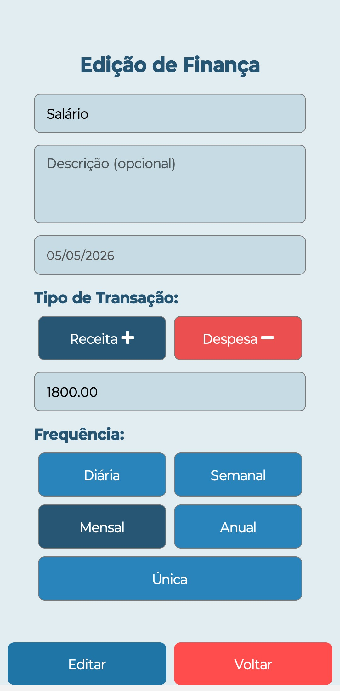
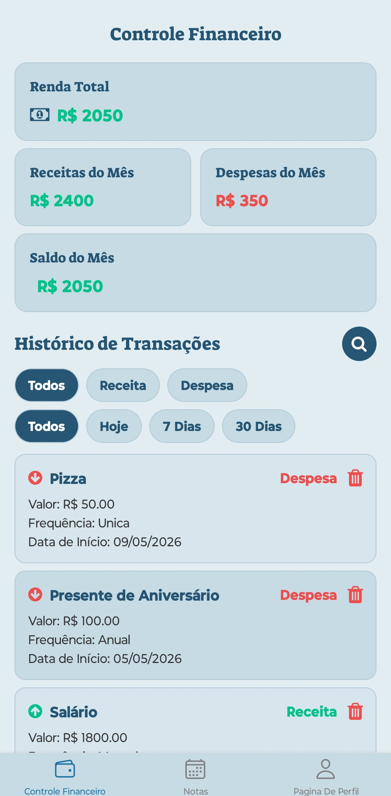

# ScheduleWell 📱

O **ScheduleWell** é um aplicativo mobile desenvolvido para centralizar o gerenciamento financeiro e a organização da rotina do usuário em um único ambiente. A aplicação permite o controle de anotações, listas e finanças pessoais, com um módulo dedicado exclusivamente à gestão financeira.

## Visão Geral 👀

Este projeto foi desenvolvido como Trabalho de Conclusão de Curso no SENAI, no curso de Desenvolvimento de Sistemas.

O objetivo principal é demonstrar a aplicação prática de conhecimentos em desenvolvimento mobile, arquitetura de aplicações e integração com APIs.

O sistema integra organização pessoal e controle financeiro em uma única aplicação, permitindo ao usuário centralizar informações como anotações, listas e transações financeiras. A proposta do projeto é reduzir a dispersão de ferramentas e facilitar o gerenciamento cotidiano.

## Funcionalidades ⚙️

- CRUD de usuários (cadastro, autenticação e gerenciamento de conta)
- CRUD de anotações de texto
- CRUD de listas personalizadas
- CRUD de transações financeiras
- Módulo de controle financeiro com:
  - Renda total
  - Receitas e despesas mensais
  - Saldo atual
  - Histórico completo de transações
- Filtros de transações por tipo (receita e despesa)
- Filtros por período (hoje, 7 dias e 30 dias)
- Busca de anotações e transações por título

## Screenshots 📸

<p align="center">
  
  
  
</p>

<p align="center">
  
  
  
</p>

<p align="center">
  
  
  
</p>

## Tecnologias e Ferramentas Utilizadas 🧰

<p align="left">
  

  

  

  

  

  

  

  
</p>

## Arquitetura do Projeto 🏗️

O projeto foi estruturado de forma modular, com separação de responsabilidades entre configuração, serviços, componentes, rotas e telas.

### Estrutura de pastas 

- **assets/** – imagens, logos e ícones do aplicativo
- **config/** – configurações globais (ex: URL da API)
- **src/axios/** – configuração do cliente HTTP (Axios)
- **src/components/** – componentes reutilizáveis da interface
- **src/pages/** – telas principais do aplicativo
- **src/routes/** – configuração das rotas de navegação

### Arquivos principais 

- **App.js** – ponto de entrada da aplicação
- **babel.config.js** – configuração do Babel
- **eas.json** – configuração de build do Expo (EAS)
- **package.json** – gerenciamento de dependências

## Integração com Backend 🔌

A aplicação consome uma API REST responsável pelo gerenciamento de usuários, anotações e transações financeiras.

- Requisições HTTP realizadas via Axios
- Consumo centralizado em `src/axios/`
- URL base configurada em `config/URL_API.js`
- Comunicação baseada em arquitetura cliente-servidor (REST)

### Repositório da API

O backend utilizado neste projeto foi desenvolvido separadamente como parte do mesmo Trabalho de Conclusão de Curso.

- API REST: [ScheduleWell API](https://github.com/vinizamara/ScheduleWell_API)
- Tecnologias utilizadas: Node.js, Express, JWT, MySQL e Docker.

## APK / Download 📦

- APK: [Download da versão v1.0.0](https://github.com/vinizamara/ScheduleWell_Front/releases/tag/v1.0.0)

### Instalação

1. Acesse a aba **Releases** do repositório
2. Baixe o arquivo `.apk` mais recente
3. Ative instalação de fontes desconhecidas no Android (se necessário)
4. Instale o aplicativo

## Como Rodar o Projeto 🚀

### Pré-requisitos

- Node.js instalado
- Expo CLI ou Expo Go instalado
- Git instalado
- Gerenciador de pacotes (npm ou yarn)

### Instalação

```bash
git clone https://github.com/vinizamara/ScheduleWell_Front.git
cd ScheduleWell_Front
npm install
```

### Ambiente de API

O aplicativo está atualmente configurado para consumir uma API hospedada em nuvem, utilizada para demonstração e execução da aplicação em ambiente de produção.

Também é possível executar o projeto utilizando uma instância local do backend.

Para isso, altere a URL da API no arquivo:
```bash
config/URL_API.js
```

Exemplo de configuração local:
```bash
export const API_URL = "http://SEU_IP:5000/api";
```
Em dispositivos físicos, utilize o IP local da máquina em vez de localhost.

Certifique-se de que o backend esteja em execução e acessível pela mesma rede do dispositivo ou emulador.

### Execução
```bash
npx expo start
```

## Contributors 👥

Este projeto foi desenvolvido em equipe durante a fase acadêmica no SENAI.

Os colaboradores abaixo participaram diretamente do desenvolvimento original ([repositório inicial no GitLab](https://gitlab.com/schedulewell/new-project)):

<div align="left">

  <h3>- Gabriel Santos Magalhães</h3>
  <a href="https://gitlab.com/gabrielsantosmagalhaesx" target="_blank">
    
  </a>

  <h3>- Maria Laura Reis Furini</h3>
  <a href="https://gitlab.com/marialaurareisfurini" target="_blank">
    
  </a>

  <h3>- Gustavo Maríngolo Barbosa</h3>
  <a href="https://gitlab.com/gugamaringolo" target="_blank">
    
  </a>

  <h3>- Miguel de Jesus Ferreira</h3>
  <a href="https://gitlab.com/migueldejf05" target="_blank">
    
  </a>

  <h3>- Leonardo Pereira Gonçalves</h3>
  <a href="https://gitlab.com/leonardopgoncaves" target="_blank">
    
  </a>

</div>

## Autor 👨‍💻

### - Vinícius Manfrin Zamara

<div align="left">

  <a href="https://github.com/vinizamara" target="_blank">
    
  </a>

  <a href="https://www.linkedin.com/in/viniciusmanfrin/" target="_blank">
    
  </a>

  <a href="mailto:vinizamara@gmail.com" target="_blank">
    
  </a>

</div>
